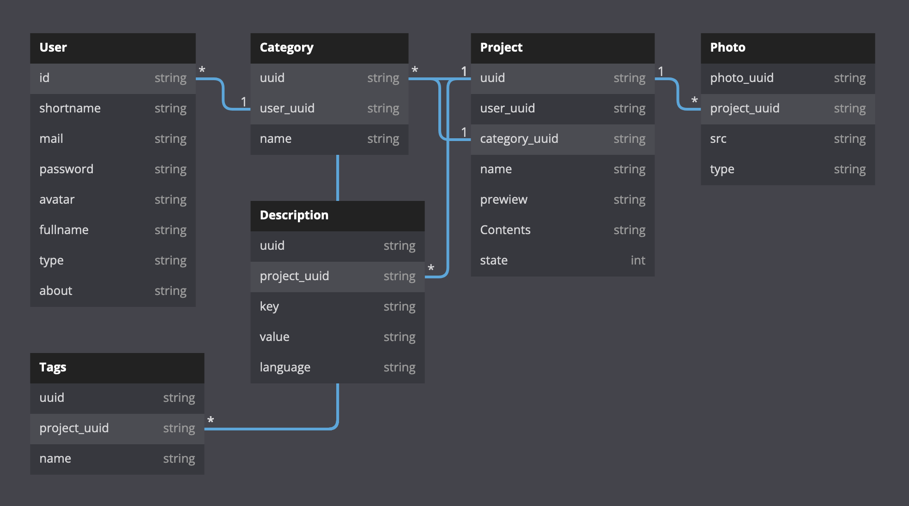

# Back-end for goportfolio.nik19ta.pro

## About the project

A highly focused portfolio content management system

- wiew my profile on [just-portfolio](https://goportfolio.nik19ta.pro/nik19ta)
- wiew [front-end](https://github.com/nik19ta/goportfolio-front) reposit repository on github

### Tools

- Lang - GoLang
- Framework - Gin
- ORM - GORM
- DB - PostgreSQL

### DB Schame



## How to run 

1. Get go packeges `go get`
2. Make .env file `make env-prepare`
2. Make images folder `make image-prepare`
3. Create postgres schema: `just_portfolio`
4. Build `make build`
5. Start `make start`

## How to run (Docker)

1. replace `postgres_host` field in env file from  `localhost` to `fullstack-postgres`
2. build docker `docker-compose build`
3. run docker `docker-compose up -d`

## Make as service (Ubuntu 20.04)

1. make file `portfolio.service` into `/etc/systemd/system`

2. paste code into `/etc/systemd/system/portfolio.service`

```service
[Unit]
Description=just-portfolio.com
ConditionPathExists=/home/user/just-portfolio/back-end
After=network.target

[Service]
WorkingDirectory=/home/user/just-portfolio/back-end
ExecStart=/home/user/just-portfolio/back-end/.bin/app

Restart=on-failure
RestartSec=10

StandardOutput=syslog
StandardError=syslog
SyslogIdentifier=appgoservice

[Install]
WantedBy=multi-user.target
```

3. start service `sudo service portfolio restart`
4. you can wiew status `sudo service portfolio status`

## Configuration Nginx 

1. create file /etc/nginx/sites-available/just-portfolio.com.conf 

2. paste the code 

```nginx
server {
    listen 80;
    listen [::]:80;

    server_name just-portfolio.com www.just-portfolio.com;
    return 301 https://just-portfolio.com$request_uri;
}

server {
    listen 443 ssl http2;
    listen [::]:443 ssl http2;

    server_name www.just-portfolio.com;
    return 301 https://just-portfolio.com$request_uri;

    ssl_certificate /etc/letsencrypt/live/just-portfolio.com/fullchain.pem;
    ssl_certificate_key /etc/letsencrypt/live/just-portfolio.com/privkey.pem;
    ssl_trusted_certificate /etc/letsencrypt/live/just-portfolio.com/chain.pem;

    include snippets/ssl-params.conf;
}

server {
    listen 443 ssl http2;
    listen [::]:443 ssl http2;

    server_name just-portfolio.com;
    root /var/www/just-portfolio.com/html;
    index index.html index.xml;

    location / {
      try_files $uri /index.html;
    }

    index index.html index.xml;
 
    location /images {
      proxy_pass http://localhost:3070;
    }

    location /api {
      proxy_pass http://localhost:3070;
    }

    ssl_certificate /etc/letsencrypt/live/just-portfolio.com/fullchain.pem;
    ssl_certificate_key /etc/letsencrypt/live/just-portfolio.com/privkey.pem;
    ssl_trusted_certificate /etc/letsencrypt/live/just-portfolio.com/chain.pem;

    include snippets/ssl-params.conf;
}
```

> for https you need to make letsencrypt certificates
